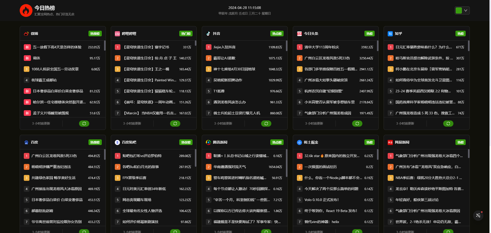

<div align="center">

<h2>今日热榜</h2>
<p>汇聚全网热点，热门尽览无余</p>
</div>

## 🚩 项目信息
* 项目预览：https://hot.baiwumm.com/
* 技术栈：[React](https://react.dev/)、[Vite](https://www.vitejs.net/)、[Ant-design](https://ant-design.antgroup.com/)

本项目已使用 [Next.js14](https://nextjs.org/) 重构，不再更新维护， 最新地址：[next-daily-hot](https://github.com/baiwumm/next-daily-hot)

## 💻 演示图

<div style="display:flex;justify-content:space-between;">


</div>

## 💯 热点平台

✅：稳定，⭕：不稳定，❌：无法使用 

| **Logo**    | **平台**     | **类别** | **接口地址** | **状态** |
| :--------: | :--------: | :--------: | :--------: |:--------: |
|| 微博     | 热搜榜 | [weibo](https://api.baiwumm.com/hot/weibo)   | ✅ |
|| 哔哩哔哩  | 热门榜   | [bilibili](https://api.baiwumm.com/hot/bilibili)   | ✅ |
|| 抖音     | 热点榜 | [douyin](https://api.baiwumm.com/hot/douyin)   | ✅ |
|| 今日头条 | 热榜     | [toutiao](https://api.baiwumm.com/hot/toutiao)   | ✅ |
|| 知乎     | 热榜 | [zhihu](https://api.baiwumm.com/hot/zhihu)   | ✅ |
|| 百度     | 热搜榜 | [baidu](https://api.baiwumm.com/hot/baidu)   | ✅ |
|| 百度贴吧  | 热议榜   | [baidutieba](https://api.baiwumm.com/hot/baidutieba)   | ✅ |
|| 腾讯新闻   | 热点榜  | [qq](https://api.baiwumm.com/hot/qq)   | ✅ |
|| 稀土掘金   | 热榜  | [juejin](https://api.baiwumm.com/hot/juejin)   | ✅ |
|| 网易新闻    | 热榜 | [netease](https://api.baiwumm.com/hot/netease)   | ✅ |
|| 英雄联盟  | 更新公告   | [lol](https://api.baiwumm.com/hot/lol)   | ✅ |
|| 澎湃新闻 | 热榜   | [thepaper](https://api.baiwumm.com/hot/thepaper)   | ✅ |
|| 快手 | 热榜   | [kuaishou](https://api.baiwumm.com/hot/kuaishou)   | ✅ |
|| 百度百科 | 历史上的今天   | [today](https://api.baiwumm.com/hot/today)   | ✅ |
|| 微信读书 | 飙升榜   | [weread](https://api.baiwumm.com/hot/weread)   | ✅ |
|| 豆瓣电影 | 新片榜   | [douban-movic](https://api.baiwumm.com/hot/douban-movic)   | ✅ |
|| 网易云音乐 | 热歌榜   | [netease-music](https://api.baiwumm.com/hot/netease-music)   | ⭕ |

> 以上 `API` 基于 [Nest.js](https://nest.nodejs.cn/) 搭建。

## ✨ 项目运行
```
// 克隆项目
git clone https://github.com/baiwumm/react-daily-hot.git

// 安装依赖
pnpm install

// 运行
pnpm dev
```

## ⚙️ Vercel 一键部署
1. `Fork` 本项目，在 `Vercel` 官网点击 `New Project`
2. 点击 `Import Git Repository` 并选择你 fork 的此项目并点击 `import`
3. `PROJECT NAME`自己填，`FRAMEWORK PRESET` 选 `Other` 然后直接点 `Deploy` 接着等部署完成即可

<a href="https://vercel.com/dashboard" target="_blank">

</a>

## ⚙️ Vecel 本地部署
```
// 全局安装 vercel
npm i -g vercel

// 登录
vercel login

// 项目推送
vercel

// 挂载生产
vercel --prod
```
> 具体教程可参考文章：[如何使用 Vercel 托管静态网站](https://baiwumm.com/p/5zzij7bt)

## ⚠️ 须知
1. 本项目的接口会频繁请求官方数据，部分接口使用了 **页面爬虫抓取**，若违反对应页面的相关规则，请 **及时通知我去除该接口**
2. 如果想集成其他平台的热搜或热点 `API`，可以提 `Issues` 
3. 本项目提供的 `API` 仅供开发者进行技术研究和开发测试使用，任何因使用本 `API` 产生的损失，本项目不负担任何赔偿和责任

## 😘 鸣谢
特此感谢为本项目提供支持与灵感的项目，本项目在其基础上使用 `React` 和 `Nest` 构建并优化，感谢开源社区提供的精神支持

- [imsyy/DailyHot](https://github.com/imsyy/DailyHot)
- [imsyy/DailyHotApi](https://github.com/imsyy/DailyHotApi)

## ⭐ Star History

[](https://star-history.com/#baiwumm/react-daily-hot&Date)